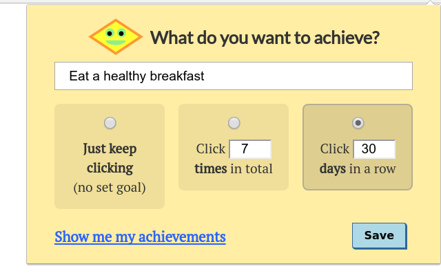

# Click Your Achievements (CYA)

[Click Your Achievements (CYA)](https://chrome.google.com/webstore/detail/click-your-achievements/dfplkfbgfajhmmdbmmilgclelehmbbnk) is a Google Chrome
Extension that helps you to keep track of your goals and achievements.

Create goals and then click each time you make progress toward them.



## Why?

Keeping track of your goals can help you to reach them by providing a little extra motivation and accountability.

Each time you "click", you'll hopefully be rewarded with a feeling of accomplishment.

Stay focused on your goals, and soon you'll be turning them into achievements!

## Features

* Track progress toward 3 types of achievements:
  * No set goal
  * Number of clicks in total
  * Number of days in a row with at least one click

## Development

```bash
# Install dependencies
npm install

# Start a development server with support for hot-reloading
npm run dev && google-chrome http://localhost:8080

# Build a Chrome extension package: ./dist/chrome.zip
npm run build
```

## License

[MIT](./LICENSE).
